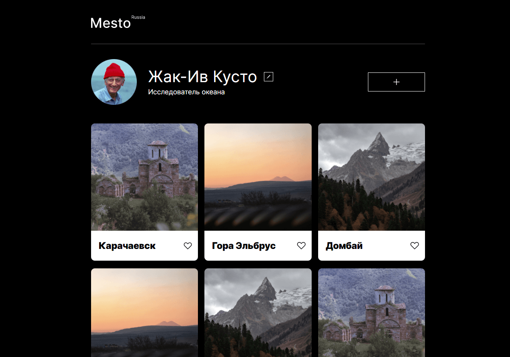

# Mesto

#### *Проект представляет собой социальную сеть с возможностью редактирования профиля, добавления и удаления своих карточек, установку и снятие лайков*
link: https://vgaidukov.github.io/mesto/
 
 ### Проект реализован с применением следующих технологий:
 - использование модальных окон
 - работа с формами
 - валидация форм
 - флексбокс-верстка
 - grid-layout
 - позиционирование
 - анимация
 - адаптивная верстка, медиазапросы
 - структурирование проекта по правилам Nested БЭМ  
   
 ## Запуск проекта

`npm run build` — запускает сборку проекта в production mode   
`npm run dev` — запускает локальный сервер

## Preview :

